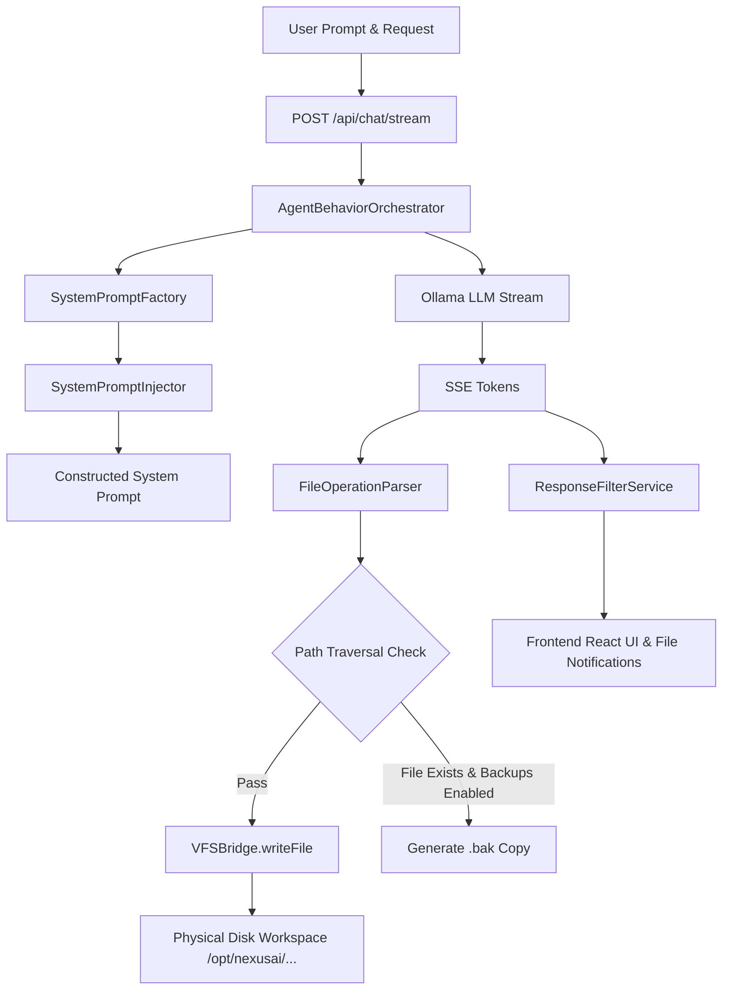

# 🧠 NexusAI Agent Behavior, System Prompt & Orchestration Specification

> **Specification Version**: v8.5.0-PROD  
> **Platform Version**: NexusAI Enterprise Agentic Platform  
> **Target OS**: AlmaLinux 10 / Ubuntu 26.04 LTS / RHEL 10 / WSL  
> **Author**: Senior AI Agent Systems Architect & LLM Behavior Engineer  

---

## 1. Executive Overview

The **NexusAI Agent Behavior & Orchestration Engine** provides the intelligence layer that coordinates LLM prompt construction, mode directives, display mode enforcement, stream processing, and physical Virtual File System (VFS) disk generation.

### Key Capabilities
1. **Dynamic System Prompt Factory** ([server/systemPromptFactory.js](file:///opt/nexusai/server/systemPromptFactory.js)): Builds context-aware system prompts combining Workspace Context, 6 Agentic Modes (`PLAN`, `BUILD`, `REVIEW`, `TEST`, `DEPLOY`, `LEARN`), Code Display Modes (`workspace`, `chat`, `hybrid`), and Security & Path Safety Rules.
2. **Response Filtering & File Operation Parser** ([server/responseFilterService.js](file:///opt/nexusai/server/responseFilterService.js)): Extracts file operation structures (`create`, `update`, `delete`, `batch`) and calculates line counts, byte sizes, and summary statistics.
3. **Agent Behavior Orchestrator** ([server/agentOrchestrator.js](file:///opt/nexusai/server/agentOrchestrator.js)): Manages high-speed SSE streaming, path traversal validation, safety `.bak` backup generation, and database message persistence.

---

## 2. Architecture Diagram



---

## 3. Dynamic System Prompt Factory Schema

```javascript
class SystemPromptFactory {
    buildFullPrompt(workspaceContext, mode, chatConfig) {
        return `
${this.baseIdentity}
${this.buildWorkspaceContext(workspaceContext)}
${this.buildModeInstructions(mode)}
${this.buildConfigurationInstructions(chatConfig)}
${this.buildBehaviorRules()}
${this.buildFileOperationInstructions(chatConfig)}
${this.buildResponseFormattingRules(chatConfig)}
${this.buildSecurityRules()}
${this.buildProjectContext()}
`;
    }
}
```

### Mode Instructions Summary
- **PLAN Mode (`Ctrl+1`)**: Strategic architecture, requirements, sequence & Mermaid.js component diagrams.
- **BUILD Mode (`Ctrl+2`)**: Full-stack production-ready code generation with filename-tagged code blocks (e.g., \`\`\`jsx:src/App.jsx).
- **REVIEW Mode (`Ctrl+3`)**: AST quality audits, OWASP security scanning, and diff recommendations.
- **TEST Mode (`Ctrl+4`)**: Automated unit testing, integration tests, and coverage analysis.
- **DEPLOY Mode (`Ctrl+5`)**: Nginx reverse proxy, Docker, PM2, and CI/CD pipelines.
- **LEARN Mode (`Ctrl+6`)**: Pattern extraction, ADR documentation, and RAG knowledge vault.

---

## 4. File Operation Parsing & Security

### 4.1 Path Traversal Safeguard
Before any file operation is executed, the Orchestrator resolves the absolute path and verifies it remains within the active workspace root:
```javascript
const resolvedTarget = path.resolve(activeTargetWs);
const fullPath = path.resolve(activeTargetWs, filename);
if (!fullPath.startsWith(resolvedTarget)) {
  console.warn(`⚠️ [VFS Security Check] Prevented path traversal attempt to ${filename}`);
  return;
}
```

### 4.2 Safety Backup Protocol (`.bak`)
When updating an existing file with `createBackups` enabled:
1. `fs.access(fullPath)` detects existing file.
2. File is copied to `${fullPath}.bak`.
3. New content is written atomically via `VFSBridge.writeFile`.

---

## 5. Deployment & Verification

- **Production Build**: Verified with `npm run build` (0 errors).
- **PM2 Backend Service**: Process `nexusai2-backend` (ID 24) running online with `PORT=3005`.
- **API Status**: Clean SSE streaming and VFS auto-file generation active on `https://nx.xus.me`.
