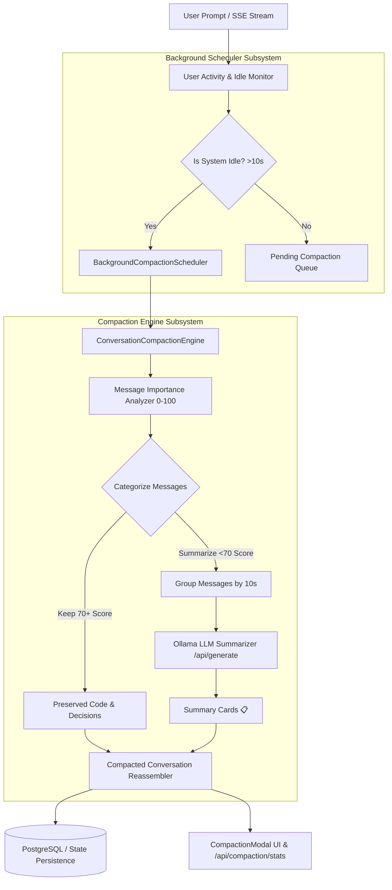

# 📋 NexusAI Conversation Compaction & State Management Specification

> **Specification Version**: v9.5.0-PROD  
> **Platform Version**: NexusAI Enterprise Agentic Platform  
> **Target OS**: AlmaLinux 10 / Ubuntu 26.04 LTS / RHEL 10 / WSL  
> **Author**: Senior Data Compression Architect & Conversation State Management Specialist  

---

## 1. Executive Overview

This specification establishes the **Intelligent Conversation Compaction & Memory Management System** for NexusAI. Long-running chat sessions (1000+ messages) are automatically compacted in the background without user interruption or stream latency degradation. Important technical context, code blocks, user requirements, and system file generation notices are preserved, while older conversational chatter is summarized into structured Markdown cards (`📋 Compacted Context Summary`).

---

## 2. System Architecture

---

## 3. Core Engine Implementations

### 3.1 Conversation Compaction Engine ([server/compactionEngine.js](file:///opt/nexusai/server/compactionEngine.js))
- **Message Importance Scoring (0–100 Points)**:
  - **Recency Weight**: Up to 25 points.
  - **User Role Weight**: 15 points.
  - **Technical Content / Code Blocks**: 25 points.
  - **Question & Requirement Keywords**: 15 points.
  - **File Generation Notices (`✅ Verified Workspace File`)**: 20 points.
- **Categorization**: Retains system prompts, recent 15 messages, and high-scoring items (70+ score); groups older items into 10-message blocks for AI summarization.

### 3.2 Background Compaction Scheduler ([server/backgroundCompactionScheduler.js](file:///opt/nexusai/server/backgroundCompactionScheduler.js))
- **Non-Disruptive Idle Monitoring**: Checks system idle status (`isSystemIdle()`) based on CPU usage, SSE stream status, and time since last user interaction (>10s).
- **Zero Interruption**: Compactions run in background threads without blocking the Node.js event loop or UI render state.

### 3.3 Interactive Compaction Controls UI ([src/components/Modals/CompactionModal.jsx](file:///opt/nexusai/src/components/Modals/CompactionModal.jsx))
- **Threshold Controls**: Configurable trigger message threshold (default 50 msgs) and summary sentence count (default 3 sentences).
- **Live Compaction Telemetry**: Displays total compactions, messages compacted, memory saved (KB), and average compaction time (ms).

---

## 4. Verification & Production Deployment

- **Frontend Build**: Verified with `npm run build` (0 errors).
- **PM2 Backend Service**: `nexusai2-backend` (ID 24) online on port `3005`.
- **Live Status API Endpoints**:
  - `POST /api/compaction/compact`
  - `GET /api/compaction/stats`
