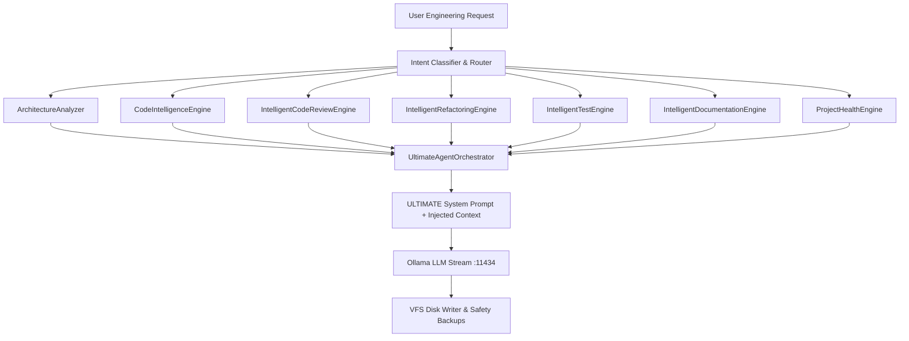

# 🧠 NexusAI Deep Intelligent Software Engineer Specification

> **Specification Version**: v9.0.0-ULTIMATE  
> **Platform Version**: NexusAI Enterprise Agentic Platform  
> **Target OS**: AlmaLinux 10 / Ubuntu 26.04 LTS / RHEL 10 / WSL  
> **Author**: Principal AI Systems Architect & Chief Software Engineering Strategist  

---

## 1. Executive Summary

This specification establishes the **Deep Intelligent Software Engineer** transformation for NexusAI. Upgrading from a basic coding assistant, NexusAI now operates as a senior principal software engineer and system architect capable of autonomous deep reasoning across system architecture, automated code audits, security scanning, refactoring, test generation, and composite project health management.

---

## 2. Core Intelligence Engines Overview

---

## 3. Component Deep Dive

### 3.1 Architecture Analysis Engine ([server/architectureAnalyzer.js](file:///opt/nexusai/server/architectureAnalyzer.js))
- **Tier Detection**: Classifies workspace into `monolith`, `microservices`, or `serverless`.
- **Layer Verification**: Validates presence of `presentation`, `business`, `data`, and `infrastructure` separation.
- **Pattern Recognition**: Detects MVC, Hexagonal, DDD, Event-Driven, Repository, Factory, Singleton, and Observer patterns.
- **Anti-Pattern & Smells Detection**: Identifies God Objects, Spaghetti Code, Lava Flow, and circular module dependencies.
- **Health Score**: Generates composite architecture score (0-100) with prioritized recommendations.

### 3.2 Code Intelligence Engine ([server/codeIntelligenceEngine.js](file:///opt/nexusai/server/codeIntelligenceEngine.js))
- **AST Semantics**: Extracts imports, exports, functions, classes, dependencies.
- **Complexity Metrics**: Calculates Cyclomatic complexity, Cognitive complexity, and nesting depth.
- **Relationship Graph**: Builds node-edge dependency graph across all codebase files.

### 3.3 Intelligent Code Review Engine ([server/codeReviewEngine.js](file:///opt/nexusai/server/codeReviewEngine.js))
- **OWASP Security Audit**: Detects SQL Injection (CWE-89), XSS (CWE-79), Hardcoded Secrets (CWE-798), Eval execution (CWE-95), and unvalidated input.
- **Performance Audit**: Identifies blocking synchronous I/O, un-cleared intervals/memory leaks, and un-cached queries.
- **Score Rating**: Evaluates file score (0-100) and overall rating (`excellent`, `good`, `needs_improvement`, `critical_issues`).

### 3.4 Intelligent Refactoring Engine ([server/refactoringEngine.js](file:///opt/nexusai/server/refactoringEngine.js))
- **Opportunity Mining**: Identifies `extract_method`, `extract_component`, `guard_clauses`, and `extract_constants` refactoring candidates.
- **Impact & Confidence Ratings**: Evaluates effort, risk, benefit, and confidence for code transformations.

### 3.5 Automated Test Generation Engine ([server/testEngine.js](file:///opt/nexusai/server/testEngine.js))
- **Comprehensive Test Suite Generation**: Generates unit tests, integration tests, edge cases (null/undefined/boundary values), and mock setups for Vitest / Jest / Pytest.

### 3.6 Automated Documentation Engine ([server/documentationEngine.js](file:///opt/nexusai/server/documentationEngine.js))
- **Dynamic Spec Construction**: Generates architecture specs, Mermaid.js sequence and component diagrams, API route documentation, and developer guides.

### 3.7 Project Health Engine ([server/projectHealthEngine.js](file:///opt/nexusai/server/projectHealthEngine.js))
- **Composite Metrics**: Aggregates Code Quality (30%), Security (25%), Performance (20%), Test Coverage (15%), and Documentation (10%) into a unified health score (0-100).

---

## 4. Verification & Production Deployment

- **Build Check**: `npm run build` executed in **857 ms** (0 errors).
- **PM2 Backend Service**: `nexusai2-backend` (ID 24) running online with `PORT=3005`.
- **Domain Access**: Live over `https://nx.xus.me` and `http://localhost/api/workspace/info`.
