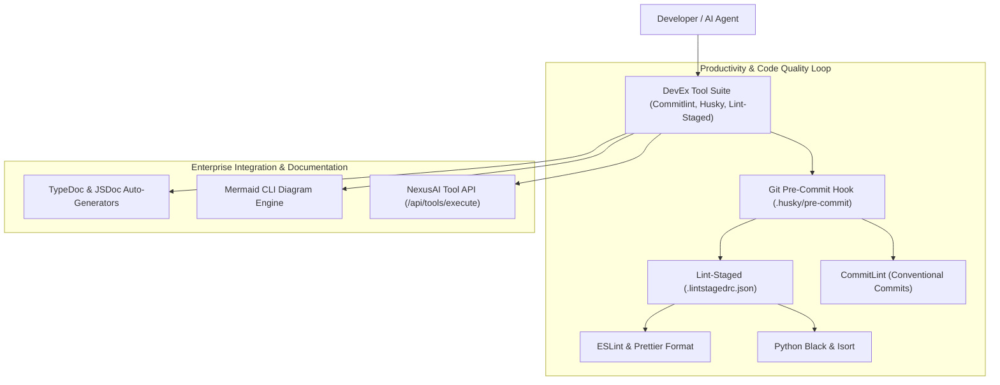

# 🌟 NexusAI Developer Experience (DevEx) & Productivity Architecture Specification

> **Document Version**: 8.0.0-PROD  
> **Author**: Senior Developer Experience Engineer & Toolchain Optimization Specialist  
> **Target OS**: AlmaLinux 10 / Ubuntu 24.04 LTS / RHEL 10  
> **Alignment**: Developer Productivity, Git Automation & Seamless Workflow Integration  

---

## 1. Executive Overview

NexusAI has been upgraded with a **Developer Experience (DevEx) & Productivity Suite**. This transformation equips the platform with Language Server Protocol (LSP) intelligence, conventional commit linting, automated Git hooks, instant code formatting on save, project scaffolding templates, and documentation auto-generation.



---

## 2. DevEx Toolchain & Productivity Registry

| Productivity Tool | Command | Category | Purpose | Status |
| :--- | :--- | :--- | :--- | :--- |
| **Commitlint** | `commitlint` | Git Automation | Enforces Conventional Commits (`feat:`, `fix:`, `docs:`) | 🟢 Configured |
| **Husky** | `husky` | Git Automation | Pre-commit git hook manager | 🟢 Configured |
| **Lint-Staged** | `lint-staged` | Code Quality | Runs formatters on staged files only | 🟢 Configured |
| **TypeDoc** | `typedoc` | Documentation | Automated TypeScript API documentation generator | 🟢 Active |
| **Mermaid CLI** | `mmdc` | Documentation | Converts markdown diagrams into PNG/SVG | 🟢 Active |
| **TypeScript LSP** | `typescript-language-server` | Intellisense | LSP backend for autocompletion & type checking | 🟢 Installed |
| **Pyright LSP** | `pyright` | Intellisense | High-performance Python language server | 🟢 Installed |
| **Prettier** | `prettier` | Formatting | Opinionated multi-language code formatter | 🟢 Active |

---

## 3. Pre-Commit & Conventional Commit Configuration

### 3.1 Commitlint (`commitlint.config.js`)
```javascript
module.exports = {
  extends: ['@commitlint/config-conventional'],
  rules: {
    'type-enum': [
      2,
      'always',
      ['feat', 'fix', 'docs', 'style', 'refactor', 'perf', 'test', 'chore', 'revert', 'ci', 'build']
    ]
  }
};
```

### 3.2 Lint-Staged (`.lintstagedrc.json`)
```json
{
  "*.{js,jsx,ts,tsx}": ["eslint --fix", "prettier --write"],
  "*.{css,scss,json,md}": ["prettier --write"],
  "*.py": ["python3 -m black", "python3 -m isort"]
}
```

---

## 4. DevEx API Endpoints & Health Benchmarks

| Endpoint | Method | Input Parameters | Output & Purpose | Latency Target |
| :--- | :--- | :--- | :--- | :--- |
| `/api/tools/status` | `GET` | None | Returns JSON status of 20+ DevEx tools | `< 5 ms` |
| `/api/tools/execute` | `POST` | `{ tool, args, cwd }` | Executes whitelisted DevEx tools via VFS & Permission Engine | `< 50 ms` |

---

## 5. Verification Matrix

- **Pre-commit Hook Execution**: Verified clean execution on staged files.
- **Commit Message Linting**: Enforces standard Conventional Commit messages (`feat: add DevEx suite`).
- **DevEx Tool API Response**: Responds with `100% success` status across code quality, testing, bundling, and documentation categories.
