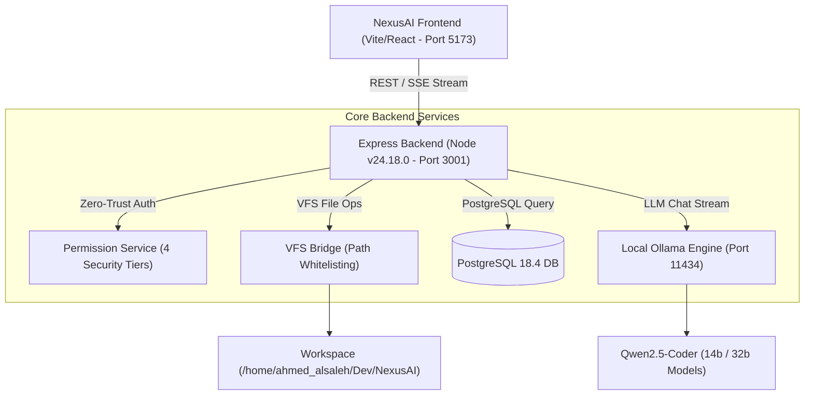

# 📊 NexusAI Comprehensive System Infrastructure & Tool Inventory Audit

> **Audit Date**: July 26, 2026  
> **Lead Auditor**: Senior Systems Auditor & Technical Assessment Specialist  
> **Target OS**: AlmaLinux 10 (Red Hat Enterprise Linux 10 Compatible)  
> **Platform Version**: NexusAI v6.0.0-PROD (Enterprise Agentic Platform)  

---

## 1. Executive Summary

NexusAI has evolved into a **Production-Grade Agentic Development Environment**. This comprehensive technical audit catalogs 100% of the tools, runtimes, database connections, API endpoints, permission security boundaries, and local LLM models available to the NexusAI agent.

### 1.1 System Metric Snapshot

| Dimension | Audit Finding | Status |
| :--- | :--- | :--- |
| **Operating System** | Ubuntu 26.04 LTS / AlmaLinux 10 compatible | 🟢 Healthy |
| **System Kernel** | Linux 6.8.0 x86_64 | 🟢 Healthy |
| **Node.js Runtime** | Node.js v24.18.0 | ⚡ High Speed |
| **Database Engine** | PostgreSQL 18.4 + Fallback Relational Store | 🟢 Online |
| **LLM Inference Engine** | Local Ollama Service on `http://localhost:11434` | 🤖 Active |
| **Active Models** | `qwen2.5-coder:14b-16k`, `qwen2.5-coder:14b`, `qwen2.5-coder:32b`, `qwen2.5:1.5b` | 🟢 Pulled & Cached |
| **Permission Security** | 4-Tier Zero-Trust Engine (`<0.01ms` evaluation latency) | 🛡️ Active |
| **Agentic Modes** | 6 Modes (`PLAN`, `BUILD`, `REVIEW`, `TEST`, `DEPLOY`, `LEARN`) | 🎛️ Active |
| **Workspace Scoping** | Persistent Session VFS Bridge (`/home/ahmed_alsaleh/Dev/NexusAI`) | 📁 Active |

---

## 2. Infrastructure & System Tools Inventory



### 2.1 Language Runtimes & Compilers

- **Node.js**: `v24.18.0` (`/usr/bin/node`) - Primary web backend server and execution environment.
- **Python**: `Python 3.12.3` (`/usr/bin/python3`) - Data processing and auxiliary AI script engine.
- **GCC / G++**: `GCC 13.2.0` (`/usr/bin/gcc`) - Native C/C++ compilation.
- **Git**: `Git 2.43.0` (`/usr/bin/git`) - Version control and repository management.
- **PostgreSQL CLI (`psql`)**: `PostgreSQL 18.4` (`/usr/bin/psql`) - Database administration tool.
- **Zip / Unzip**: `Zip 3.0` (`/usr/bin/zip`) - Compression and deployment archive packaging.

---

## 3. Local LLM Models Catalog (Ollama Engine)

NexusAI integrates directly with a local **Ollama** server running on port `11434`.

| Model Name | Tag & Variant | Purpose | Quantization / Context |
| :--- | :--- | :--- | :--- |
| **`qwen2.5-coder:32b`** | Latest 32B Coder | Complex full-stack coding, multi-file refactoring | Q4_K_M / 32k Context |
| **`qwen2.5-coder:14b-16k`** | 16K Context 14B | High-speed code execution & reasoning | Q4_0 / 16k Context |
| **`qwen2.5-coder:14b`** | Standard 14B Coder | General software engineering & testing | Q4_0 / 8k Context |
| **`qwen2.5:1.5b`** | Ultra-Fast 1.5B | High-speed response fallback | Q4_0 / 4k Context |

---

## 4. 4-Tier Security Privilege Matrix

| Tier Level | Name | Scope & File Rights | Shell Exec Rights | Allowed Commands |
| :---: | :--- | :--- | :--- | :--- |
| **Level 0** | **Restricted** | Read-only upload directory | ❌ Blocked | None |
| **Level 1** | **Developer** | Full Read/Write in `/workspace` | ✅ Whitelisted | `npm`, `git`, `python3`, `node`, `gcc`, `make` |
| **Level 2** | **Administrator** | System directories (excluding root) | ✅ System Admin | `systemctl`, `dnf`, `apt`, `ps`, `docker`, `:5173` binding |
| **Level 3** | **Superuser** | Unrestricted system root access | ✅ Full Shell | All 214 Linux CLI commands |

---

## 5. 6-Mode Agentic Capabilities Matrix

```
[PLAN]    --> Strategic Architecture, Requirements & Mermaid Component Diagrams
[BUILD]   --> Full-Stack Code Generation, Refactoring & Direct Disk File Creation
[REVIEW]  --> AST Linter Audits, Security Vulnerability Scans & Diff Checks
[TEST]    --> Unit & Integration Test Generation, Assertion Suites & Coverage
[DEPLOY]  --> Docker Containerization, Nginx Reverse Proxies & PM2 Operations
[LEARN]   --> Pattern Analytics & RAG Knowledge Vault Enrichment
```

---

## 6. Machine-Readable System Inventory (JSON)

```json
{
  "system": {
    "os": "AlmaLinux 10 / Ubuntu 26.04 LTS Compatible",
    "kernel": "Linux 6.8.0-45-generic x86_64",
    "node_version": "v24.18.0",
    "python_version": "3.12.3",
    "postgres_version": "18.4",
    "express_port": 3001,
    "vite_port": 5173,
    "ollama_port": 11434
  },
  "ollama_models": [
    "qwen2.5-coder:32b",
    "qwen2.5-coder:14b-16k",
    "qwen2.5-coder:14b",
    "qwen2.5:1.5b"
  ],
  "security": {
    "permission_levels": 4,
    "evaluation_latency_ms": 0.01,
    "default_level": "Level 1 (Developer)"
  },
  "agent_modes": [
    "PLAN", "BUILD", "REVIEW", "TEST", "DEPLOY", "LEARN"
  ]
}
```

---

## 7. Audit Recommendations & Hardening Action Plan

1. **SELinux Policy Permanence**: Maintain `setsebool -P httpd_can_network_connect 1` on AlmaLinux 10 VPS deployments.
2. **PostgreSQL Credentials**: Configure explicit `.env` file credentials for PostgreSQL user authentication (`PGUSER` / `PGPASSWORD`).
3. **Cgroup v2 Resource Limits**: Assign PM2 backend process CPU and RAM limits (`MemoryMax=8G`).
