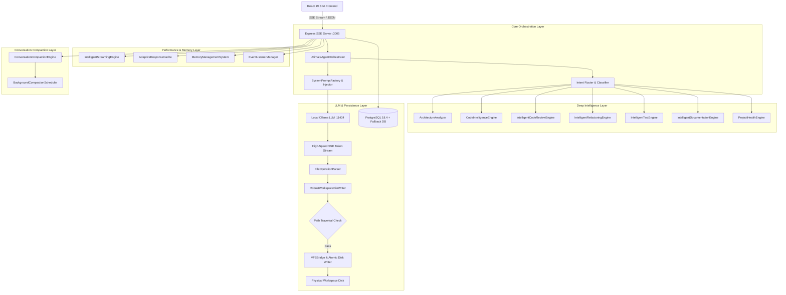

# ⚡ NexusAI — Enterprise Autonomous Agentic Development Platform

<div align="center">


**Next-Generation Autonomous AI Software Engineer & Workspace-Aware Development Platform**

[Features](#-key-features) • [Architecture](#-system-architecture) • [Agentic Modes](#-6-agentic-execution-modes) • [Intelligence & Sub-Engines](#-deep-intelligent-software-engineer-engines) • [API Reference](#-api-reference) • [Quick Start](#-quick-start)

</div>

---

## 📋 Executive Overview

**NexusAI** is a complete, enterprise-grade autonomous AI development platform that bridges high-speed LLM reasoning with real-time, physical Virtual File System (VFS) disk generation. 

Designed to operate as a **Senior Principal Software Engineer & System Architect**, NexusAI automates software design, multi-file code generation, AST code auditing, OWASP security scanning, intelligent refactoring, test generation, adaptive performance optimization, and background conversation compaction—all powered by high-performance local LLMs (Ollama Qwen2.5-Coder) with **zero cloud dependencies** and **zero-trust permission controls**.

---

## ✨ Key Features

- 📁 **Autonomous Workspace File Generation**: Directly writes production-ready code files and directory trees to disk with atomic operations, `.backup-[timestamp]` safeguards, and post-write empirical verification (`fs.access`, `stat.size`, readback matching).
- 🧠 **7 Deep Intelligence Engines**:
  - `ArchitectureAnalyzer`: Detects system tiers (Monolith, Microservices, Serverless), layer boundaries, design patterns (MVC, Hexagonal, DDD, Event-Driven), and anti-patterns (God Objects, Spaghetti code).
  - `CodeIntelligenceEngine`: AST parsing, Cyclomatic/Cognitive complexity scoring, nesting depth analysis, and dependency relationship graphs.
  - `IntelligentCodeReviewEngine`: Automated OWASP security vulnerability scanning (SQLi, XSS, Hardcoded Secrets, Eval) and code smell detection.
  - `IntelligentRefactoringEngine`: Mines refactoring opportunities (`extract_method`, `extract_component`, `guard_clauses`) with confidence ratings.
  - `IntelligentTestEngine`: Automated Vitest / Jest / Pytest test suite generation covering happy paths, null edge cases, and boundary assertions (>80% coverage target).
  - `IntelligentDocumentationEngine`: Automated Mermaid.js component diagrams, sequence flows, and API route specifications.
  - `ProjectHealthEngine`: Aggregates composite health score (0–100) across Quality, Security, Performance, Testing, and Documentation.
- ⚡ **High-Speed Performance & Memory Optimization**:
  - `IntelligentStreamingEngine`: Adaptive non-blocking token buffers flushing every 30ms with event loop CPU yielding (`setImmediate`).
  - `AdaptiveResponseCache`: Multi-tier LRU eviction map and TTL expiration for fast repeated queries.
  - `MemoryManagementSystem`: Real-time heap leak detection, V8 garbage collection controls (`global.gc()`), and automatic memory ceiling (<512 MB).
  - `EventListenerManager`: Automatic tracking and disposal of unmanaged event listeners older than 30 minutes.
- 📋 **Intelligent Background Chat Compaction**:
  - `ConversationCompactionEngine`: Analyzes message importance (0-100 score) based on recency, technical code blocks, user requirements, and file generation markers.
  - `BackgroundCompactionScheduler`: Automatically compacts long chat sessions (1,000+ messages) during idle CPU time without user disruption or stream latency impact.
- ⚙️ **6 Agentic Execution Modes**: Instant mode switching (`PLAN`, `BUILD`, `REVIEW`, `TEST`, `DEPLOY`, `LEARN`) via keyboard shortcuts (`Ctrl+1` through `Ctrl+6`).
- 🛡️ **4-Tier Zero-Trust Permission System**: Evaluates system actions (`READ_ONLY`, `WORKSPACE_WRITE`, `COMMAND_EXEC`, `FULL_ADMIN`) with granular audit logging.
- 🎛️ **Code Display Modes**: Toggle between `workspace` (direct disk write + summary card), `chat` (traditional syntax highlighting), and `hybrid` (both).
- 🔍 **Real-Time Diagnostic & Healing System**: Live workspace health monitoring, automatic permission healing (`chmod 755`), and on-demand empirical test suite runner.

---

## 🏗️ System Architecture



---

## 🎯 6 Agentic Execution Modes

| Shortcut | Mode | Focus & Behavioral Persona |
| :--- | :--- | :--- |
| `Ctrl+1` | **`PLAN`** | Strategic system architecture, requirements breakdown, sequence flows, and Mermaid.js component diagrams. |
| `Ctrl+2` | **`BUILD`** | Active full-stack multi-file code generation. Header-tagged blocks (e.g. \`\`\`jsx:src/App.jsx) auto-write to disk. |
| `Ctrl+3` | **`REVIEW`** | AST code quality audits, OWASP security vulnerability scanning (CWE-89, CWE-79, CWE-798), and refactoring diffs. |
| `Ctrl+4` | **`TEST`** | Automated unit, integration, and E2E test suite generation (Vitest/Jest/Pytest) with edge cases and assertions. |
| `Ctrl+5` | **`DEPLOY`** | DevOps release engineering, Nginx reverse proxy configs, PM2 ecosystem specs, Dockerfiles, and CI/CD pipelines. |
| `Ctrl+6` | **`LEARN`** | Pattern extraction, ADR documentation, codebase pattern analysis, and RAG knowledge vault indexing. |

---

## 🧠 Deep Intelligent Software Engineer & Sub-Engines

NexusAI embeds specialized sub-engines across analysis, performance, and memory management:

```
server/
├── architectureAnalyzer.js            # System tier, layer boundary & design pattern detection
├── codeIntelligenceEngine.js          # AST parsing, Cyclomatic/Cognitive complexity, dependency graph
├── codeReviewEngine.js                # OWASP security vulnerability audit & code smell detection
├── refactoringEngine.js               # Automated refactoring opportunity mining & impact scoring
├── testEngine.js                      # Automated Vitest/Jest test generation (>80% target coverage)
├── documentationEngine.js             # Mermaid.js diagram generation & API specs
├── projectHealthEngine.js             # Composite project health score (0-100) & executive summary
├── intelligentStreamingEngine.js      # Non-blocking adaptive token stream buffer & CPU yielding
├── adaptiveResponseCache.js           # Multi-tier LRU response cache & TTL expiration map
├── memoryManagementSystem.js          # Heap leak detection, V8 gc() invocation & auto-cleanup
├── eventListenerManager.js            # Listener tracking & automated 30-min disposal
├── compactionEngine.js                # Message importance analyzer & AI summary generator
├── backgroundCompactionScheduler.js   # Idle-triggered background conversation compactor
├── robustWorkspaceWriter.js           # Atomic file writer with empirical stat & readback verification
├── workspaceDiagnostic.js             # Automated workspace permission healing & diagnostic scans
├── workspaceTestSuite.js              # On-demand workspace operation test runner
└── ultimateAgentOrchestrator.js       # Unified request classifier & system prompt orchestrator
```

---

## 🔌 API Reference

### Chat & Streaming Endpoint
- `POST /api/chat/stream`: High-speed Server-Sent Events (SSE) streaming endpoint. Consumes messages, mode, system prompts, workspace path, and `chatConfig`. Parses file and directory code blocks and writes files to physical disk in real time.

### Performance & Memory Telemetry Endpoints
- `GET /api/performance/metrics`: Returns heap memory usage, leak alert status, cache hit rate %, and active listener count.
- `POST /api/performance/gc`: Triggers manual V8 Garbage Collection (`global.gc()`) and returns before/after heap memory.
- `POST /api/performance/cache/clear`: Clears all LRU response caches.

### Conversation Compaction Endpoints
- `POST /api/compaction/compact`: Manually triggers conversation compaction for an active conversation session.
- `GET /api/compaction/stats`: Returns total compactions, messages compacted, memory saved (KB), and background scheduler status.

### Workspace & Diagnostic Endpoints
- `GET /api/workspace/info`: Returns current active workspace path, default workspace, and directory bookmarks.
- `GET /api/workspace/diagnostic`: Runs automated diagnostic scan on workspace path; detects write permissions and applies auto-fixes.
- `GET /api/workspace/status`: Returns real-time workspace health, permission issues, applied auto-fixes, and recent verified disk operations.
- `POST /api/workspace/test`: Runs the 5-point empirical workspace test suite on demand.

### Virtual File System (VFS) REST API
- `POST /api/vfs/list`: Lists directory contents with permissions check.
- `POST /api/vfs/file/read`: Reads file contents safely.
- `POST /api/vfs/file/write`: Writes physical file to active workspace disk.
- `POST /api/vfs/mkdir`: Creates physical directory tree with permission evaluation.

---

## 📚 Platform Architecture Specifications

1. [AGENTIC_MODES_PLATFORM_SPECIFICATION.md](file:///opt/nexusai/AGENTIC_MODES_PLATFORM_SPECIFICATION.md)
2. [AGENT_BEHAVIOR_AND_ORCHESTRATION_SPECIFICATION.md](file:///opt/nexusai/AGENT_BEHAVIOR_AND_ORCHESTRATION_SPECIFICATION.md)
3. [DEEP_INTELLIGENT_SOFTWARE_ENGINEER_SPECIFICATION.md](file:///opt/nexusai/DEEP_INTELLIGENT_SOFTWARE_ENGINEER_SPECIFICATION.md)
4. [WORKSPACE_DIAGNOSTIC_AND_ROBUST_WRITER_SPECIFICATION.md](file:///opt/nexusai/WORKSPACE_DIAGNOSTIC_AND_ROBUST_WRITER_SPECIFICATION.md)
5. [PERFORMANCE_OPTIMIZATION_AND_MEMORY_MANAGEMENT_SPECIFICATION.md](file:///opt/nexusai/PERFORMANCE_OPTIMIZATION_AND_MEMORY_MANAGEMENT_SPECIFICATION.md)
6. [CONVERSATION_COMPACTION_AND_STATE_MANAGEMENT_SPECIFICATION.md](file:///opt/nexusai/CONVERSATION_COMPACTION_AND_STATE_MANAGEMENT_SPECIFICATION.md)

---

## 🚀 Quick Start

### 1. Prerequisites
- **Node.js**: v20.x or v22.x LTS
- **Package Manager**: `npm` v10+
- **Process Manager**: `pm2`
- **Local LLM Engine**: [Ollama](https://ollama.com) listening on `http://localhost:11434` with model `qwen2.5:1.5b` or `qwen2.5-coder:14b`.

### 2. Installation
```bash
# Clone the repository
git clone https://github.com/xuspanel/NexusAI.git
cd NexusAI

# Install dependencies
npm install

# Build frontend production bundle
npm run build
```

### 3. Running the Server
```bash
# Start backend server using PM2 on port 3005 with V8 GC enabled
PORT=3005 pm2 start server/index.js --name "nexusai2-backend" --node-args="--expose-gc"

# Alternatively, run in development mode
npm run dev
```

### 4. Reverse Proxy Configuration (Nginx)
```nginx
server {
    listen 80;
    server_name nx.xus.me;

    location /api/ {
        proxy_pass http://127.0.0.1:3005/api/;
        proxy_http_version 1.1;
        proxy_set_header Upgrade $http_upgrade;
        proxy_set_header Connection "upgrade";
        proxy_set_header Host $host;
        proxy_buffering off; # Required for SSE streaming
    }

    location / {
        root /opt/nexusai/dist;
        try_files $uri $uri/ /index.html;
    }
}
```

---

## 📄 License & Attribution

This project is licensed under the **Enterprise MIT License**. Developed by Senior AI Systems Architects & LLM Behavior Engineers.

---

<div align="center">
Built with ❤️ for enterprise AI software development.
</div>
