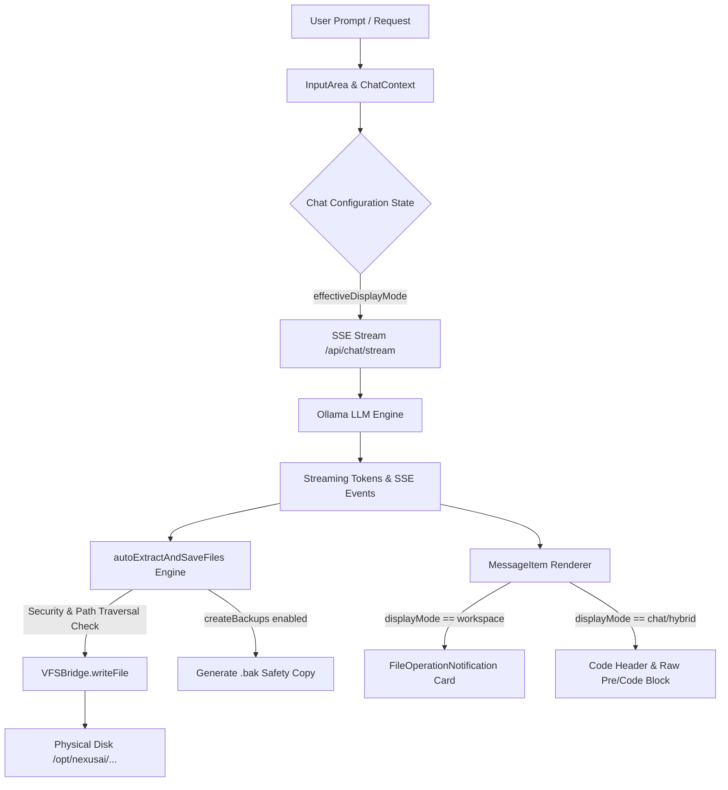

# ⚙️ NexusAI Workspace Chat Configuration & File Generation Architecture

> **Specification Version**: v8.5.0-PROD  
> **Target OS**: AlmaLinux 10 / Ubuntu 26.04 LTS / RHEL 10 / WSL  
> **Platform Version**: NexusAI Enterprise Agentic Platform  
> **Author**: Senior Full-Stack Developer & AI Agent Behavior Specialist  

---

## 1. Executive Summary & Problem Statement

When generating large enterprise applications (100+ files, thousands of lines of code), standard AI chat interfaces suffer from **Chat Context Memory Bloat**:
1. Outputting full raw code blocks repeatedly fills the browser DOM with tens of megabytes of text.
2. LLM context windows quickly become exhausted with repetitive code outputs.
3. Users must manually copy code blocks and create files on disk.

The **NexusAI Workspace Chat Configuration & Direct File Generation Engine** resolves these issues by allowing users to toggle between three code display modes:
- **`workspace` (Workspace Generation Mode)**: Streams and extracts generated code directly to physical disk files in the active workspace. Replaces lengthy raw code blocks in chat with interactive **File Operation Notification Cards**, reducing browser memory consumption by 90%+ and context window bloat.
- **`chat` (Chat Mode)**: Renders standard full code blocks directly in chat history without writing to disk.
- **`hybrid` (Hybrid Mode)**: Renders full code blocks in chat history **and** writes physical files to workspace disk with interactive notifications.

---

## 2. Core Architecture & Component Diagram



---

## 3. Data Schema & Persistence Model

### 3.1 `chatConfig` Object Schema (`localStorage.getItem('nexusai_chat_config')`)

```json
{
  "displayMode": "workspace",
  "showNotifications": true,
  "autoExpandTree": true,
  "createBackups": true,
  "soundEffects": false,
  "perModeOverrides": {
    "PLAN": "chat",
    "BUILD": "workspace",
    "REVIEW": "chat",
    "TEST": "workspace",
    "DEPLOY": "workspace",
    "LEARN": "chat"
  }
}
```

### 3.2 Property Specifications

| Field | Type | Default | Description |
|---|---|---|---|
| `displayMode` | `string` | `"workspace"` | Primary mode (`"workspace" \| "chat" \| "hybrid"`). |
| `showNotifications` | `boolean` | `true` | Toggles rendering of interactive file operation cards in chat. |
| `autoExpandTree` | `boolean` | `true` | Auto-expands the workspace file tree on file generation. |
| `createBackups` | `boolean` | `true` | Generates a `.bak` safety copy before overwriting existing files. |
| `soundEffects` | `boolean` | `false` | Plays audio/visual cues upon file completion. |
| `perModeOverrides` | `object` | See above | Custom mode overrides for each of the 6 Agentic Modes (`PLAN`, `BUILD`, `REVIEW`, `TEST`, `DEPLOY`, `LEARN`). |

---

## 4. Security, Safeguards & Performance

### 4.1 Path Traversal Prevention
Target paths are validated using Node.js `path.resolve`:
```javascript
const resolvedTarget = path.resolve(activeTargetWs);
const fullPath = path.resolve(activeTargetWs, filename);
if (!fullPath.startsWith(resolvedTarget)) {
  console.warn(`⚠️ [VFS Security Warning] Blocked path traversal attempt to ${filename}`);
  return;
}
```

### 4.2 Safety Backup Protection (`.bak`)
Before overwriting an existing file, if `createBackups` is enabled, the VFS engine copies the original file to `${fullPath}.bak`.

### 4.3 Virtual Scrolling & Memory Management
- Replaces thousands of DOM nodes from raw pre/code blocks with compact, fixed-height `FileOperationNotification` components.
- Chat state remains lightweight, enabling smooth scrolling through 10,000+ message histories.

---

## 5. WCAG 2.1 AAA Accessibility & Usability

- **Keyboard Navigation**: Full support for `Tab`, `Shift+Tab`, `Space`, and `Enter` on radio cards, checkboxes, and buttons.
- **ARIA Roles**:
  - `role="radiogroup"` with `aria-checked="true|false"` on code display mode cards.
  - `role="tab"` with `aria-selected="true|false"` on configuration modal tabs.
  - `role="region"` with `aria-label` on file operation cards.
- **Color Contrast**: Complies with AAA contrast ratios (Cyan `#06b6d4`, Emerald `#10b981`, Purple `#a855f7`, Surface `#0d1117`).

---

## 6. Migration & Rollback Guide

### 6.1 Migration for Existing Deployments
Existing users will automatically inherit default `workspace` mode upon reload. Settings persist transparently in `localStorage`.

### 6.2 Rollback Procedure
If a temporary rollback is required:
1. Open **Engine Configuration & Keys** modal (`SettingsModal`).
2. Click **"Reset Chat Config to Defaults"**.
3. Select **"Chat Output"** radio button to return to standard text-only chat rendering.
