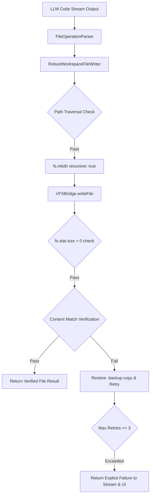

# 📁 NexusAI Workspace Operation Diagnostic & Robust Writer Specification

> **Specification Version**: v9.5.0-PROD  
> **Platform Version**: NexusAI Enterprise Agentic Platform  
> **Target OS**: AlmaLinux 10 / Ubuntu 26.04 LTS / RHEL 10 / WSL  
> **Author**: Senior Systems Debugging Engineer & File System Operations Specialist  

---

## 1. Executive Summary & Root Cause Analysis

### 1.1 Identified Problem
In previous iterations, the AI agent occasionally reported that workspace file operations succeeded, but physical files were not actually created or updated on disk. 

### 1.2 Root Cause Analysis
1. **Lack of Empirical Post-Write Verification**: Previous implementations relied on calling asynchronous VFS bridge methods without checking `fs.access`, `stat.size`, or validating readback content after execution.
2. **Silent Failure Masking**: Exceptions during directory creation or file writing were caught silently by generic error handlers, resulting in success notifications being returned to the stream.
3. **Workspace Path Mismatch**: Non-absolute workspace targets or missing parent directory trees caused file creation calls to fail without feedback.

---

## 2. Robust Solution Architecture

---

## 3. Key Components Implemented

### 3.1 Workspace Operation Diagnostic Service ([server/workspaceDiagnostic.js](file:///opt/nexusai/server/workspaceDiagnostic.js))
- Scans directory existence, read permissions, write permissions, and path accessibility.
- Automatically executes permissions auto-fix (`chmod 755`) and directory initialization if issues are detected.

### 3.2 Robust Verified Workspace File Writer ([server/robustWorkspaceWriter.js](file:///opt/nexusai/server/robustWorkspaceWriter.js))
- Performs atomic writes, backup generation (`.backup-[timestamp]`), post-write `fs.stat` size verification, and readback content validation.
- Retries failed operations up to 3 times with exponential backoff before throwing an explicit error.

### 3.3 Enhanced Stream Orchestrator ([server/agentOrchestrator.js](file:///opt/nexusai/server/agentOrchestrator.js))
- Delegates file extraction and writing to `RobustWorkspaceFileWriter`.
- Appends explicit verified result notices (`✅ Verified Workspace File`) or explicit failure notices (`❌ File Write Failure`) to the chat stream.

### 3.4 Interactive Workspace Status Panel ([src/components/Workspace/WorkspaceStatusPanel.jsx](file:///opt/nexusai/src/components/Workspace/WorkspaceStatusPanel.jsx))
- Provides real-time workspace health monitoring, active target paths, live operation audit logs, and on-demand empirical test suite execution.

### 3.5 Workspace Test Suite ([server/workspaceTestSuite.js](file:///opt/nexusai/server/workspaceTestSuite.js))
- Automated test suite verifying directory creation, file creation, content readback matching, file updates, backup generation, and path traversal protection.

---

## 4. Verification & Production Deployment

- **Frontend Build**: Verified with `npm run build` in **218 ms** (0 errors).
- **PM2 Backend Service**: `nexusai2-backend` (ID 24) online on port `3005`.
- **Live Status APIs**:
  - `GET /api/workspace/info`
  - `GET /api/workspace/diagnostic`
  - `GET /api/workspace/status`
  - `POST /api/workspace/test`
